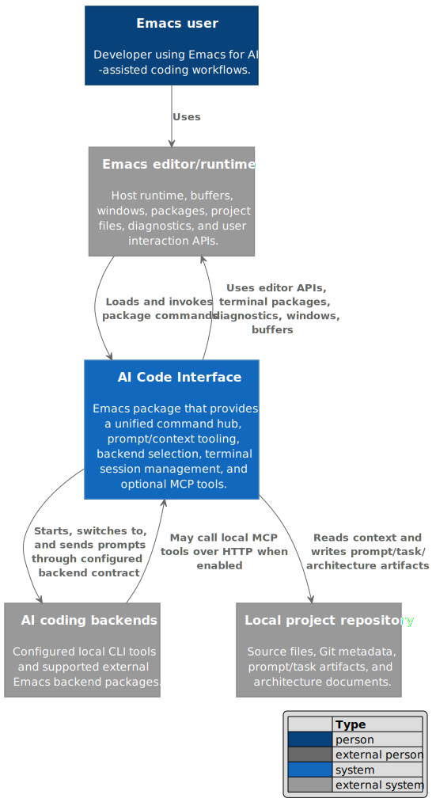
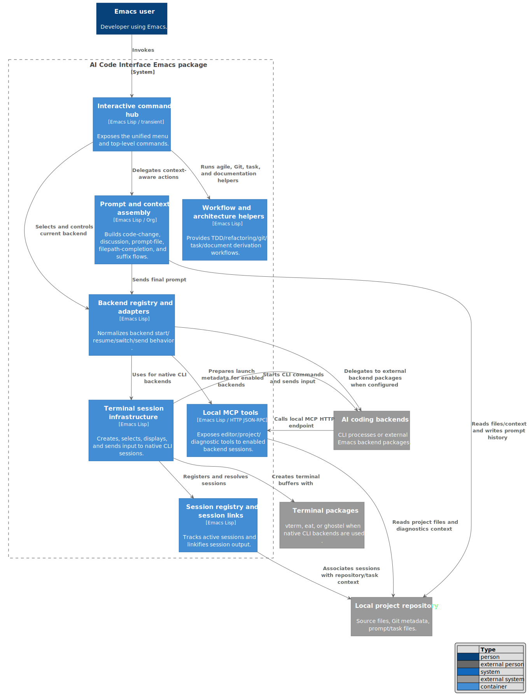
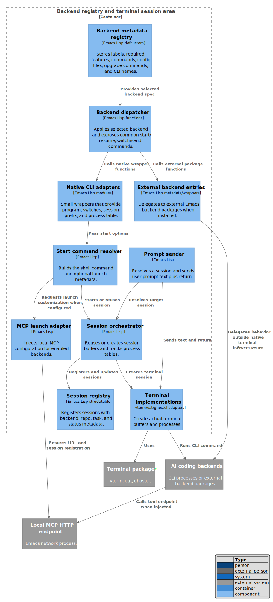
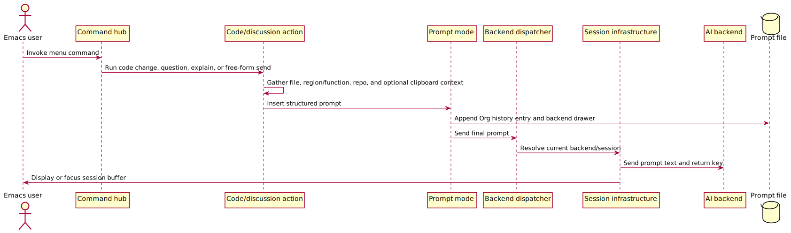
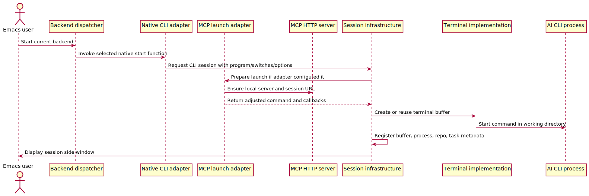
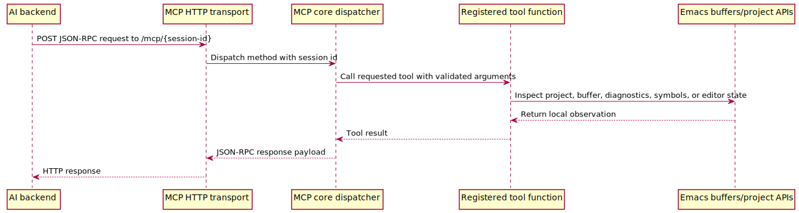

#+TITLE: C4 Architecture Overview

* Purpose
This generated guide is a human-reviewable C4-style architecture draft for the AI Code Interface Emacs package. It explains the observed system boundaries, major logical containers, one focused component view, and important runtime flows inferred from the repository.

It does not prove that every runtime path works in every user configuration. It also does not assert deployment topology beyond what is present in source and documentation: this package runs inside Emacs, starts or talks to configured local AI coding backends, stores prompt/task artifacts under the repository, and can expose local Emacs tools through a local MCP HTTP transport.

* Confidence and Assumptions
- Confidence: medium-high for the main Emacs package, backend registry, native terminal session infrastructure, prompt flow, MCP tool core, and test/CI shape because these are directly supported by source and tests.
- Source inputs: the package entry point [[file:../../ai-code.el::ai-code-menu][ai-code-menu]], backend registry [[file:../../ai-code-backends.el::ai-code-backends][ai-code-backends]], terminal infrastructure [[file:../../ai-code-backends-infra.el::ai-code-backends-infra--start-cli-session][ai-code-backends-infra--start-cli-session]], prompt pipeline [[file:../../ai-code-prompt-mode.el::ai-code--insert-prompt][ai-code--insert-prompt]], MCP server core [[file:../../ai-code-mcp-server.el::ai-code-mcp--builtin-tool-specs][ai-code-mcp--builtin-tool-specs]], README documentation [[file:../../README.org::*AI Code Interface][AI Code Interface README]], ERT tests such as [[file:../../test/test_ai-code-backends.el::ai-code-test-agent-shell-backend-spec-contract][backend contract tests]], and CI configuration [[file:../../.github/workflows/melpazoid.yml::name: melpazoid][melpazoid workflow]].
- Assumption: "container" means a major logical unit inside an Emacs package, not a Docker or deployment container.
- Assumption: "AI coding backend" is a deliberately broad boundary covering native CLI processes and supported external Emacs backend packages because [[file:../../ai-code-backends.el::ai-code-backends][ai-code-backends]] registers both kinds behind one command contract.
- Unverified area: exact behavior of every third-party CLI or external backend package is not proven by this repository; only wrapper metadata and local adapter code are visible.
- Unverified area: PlantUML C4 rendering depends on the reader's local PlantUML setup and availability of the C4 include library.

* Repository Summary
- Provides one Emacs command hub for AI-assisted coding workflows through [[file:../../ai-code.el::ai-code-menu][ai-code-menu]].
- Normalizes backend operations through start, resume, switch, and send functions managed by [[file:../../ai-code-backends.el::ai-code--apply-backend][ai-code--apply-backend]].
- Runs native CLI backends inside selectable Emacs terminal backends through [[file:../../ai-code-backends-infra.el::ai-code-backends-infra--create-terminal-session][ai-code-backends-infra--create-terminal-session]].
- Builds context-aware prompts for code changes and discussions through modules such as [[file:../../ai-code-change.el::ai-code--compose-code-change-brief][ai-code--compose-code-change-brief]] and [[file:../../ai-code-discussion.el::ai-code-ask-question][ai-code-ask-question]].
- Records and sends prompts through the Org-derived prompt mode implemented by [[file:../../ai-code-prompt-mode.el::ai-code-prompt-mode][ai-code-prompt-mode]].
- Optionally exposes local Emacs project/editor tools to selected backends via [[file:../../ai-code-mcp-agent.el::ai-code-mcp-agent-prepare-launch][ai-code-mcp-agent-prepare-launch]], [[file:../../ai-code-mcp-http-server.el::ai-code-mcp-http-server-ensure][ai-code-mcp-http-server-ensure]], and [[file:../../ai-code-mcp-server.el::ai-code-mcp-dispatch][ai-code-mcp-dispatch]].
- Maintains active session metadata and a dashboard through [[file:../../ai-code-session.el::ai-code-session-register][ai-code-session-register]] and [[file:../../ai-code-session.el::ai-code-session-dashboard][ai-code-session-dashboard]].

* Glossary
- AI Code Interface: the Emacs Lisp package centered on [[file:../../ai-code.el::provide 'ai-code][ai-code]].
- Backend: an entry in [[file:../../ai-code-backends.el::ai-code-backends][ai-code-backends]] with metadata for start, switch, send, resume, config, upgrade, and CLI behavior.
- Native CLI backend: a local wrapper module, for example [[file:../../ai-code-codex-cli.el::ai-code-codex-cli][ai-code-codex-cli]], that starts a command-line tool through shared terminal infrastructure.
- External backend: an integration entry that delegates to another Emacs package, for example the ECA entry tested by [[file:../../test/test_ai-code-backends.el::ai-code-test-eca-backend-spec-contract][ai-code-test-eca-backend-spec-contract]].
- Terminal backend: the selectable Emacs terminal implementation configured by [[file:../../ai-code-backends-infra.el::ai-code-backends-infra-terminal-backend][ai-code-backends-infra-terminal-backend]].
- Prompt file: the Org prompt history file named by [[file:../../ai-code-prompt-mode.el::ai-code-prompt-file-name][ai-code-prompt-file-name]].
- Repo context: stored context managed by [[file:../../ai-code-utils.el::ai-code--repo-context-info][ai-code--repo-context-info]] and rendered by [[file:../../ai-code-utils.el::ai-code--format-repo-context-info][ai-code--format-repo-context-info]].
- MCP tools: local editor/project tools registered by [[file:../../ai-code-mcp-server.el::ai-code-mcp-builtins-setup][ai-code-mcp-builtins-setup]] and dispatched by [[file:../../ai-code-mcp-server.el::ai-code-mcp-dispatch][ai-code-mcp-dispatch]].

* How to Read These Diagrams
Read the diagrams in this order:

1. System Context: understand who uses the package and which supported external boundaries it crosses.
2. Container View: understand the major logical units inside the Emacs package and what each owns.
3. Component View: inspect the backend/session area because it is the main architectural seam between the common user workflow and individual AI backends.
4. Runtime flows: follow how prompts, sessions, and MCP tool calls move through the system.

The diagrams intentionally use fewer boxes than the repository has files. The detailed evidence is in the notes and Source Evidence section.

* System Context
#+begin_src plantuml :file c4-context.svg :exports both
@startuml
!include <C4/C4_Context>

LAYOUT_WITH_LEGEND()

Person(user, "Emacs user", "Developer using Emacs for AI-assisted coding workflows.")
System(aiCode, "AI Code Interface", "Emacs package that provides a unified command hub, prompt/context tooling, backend selection, terminal session management, and optional MCP tools.")
System_Ext(emacs, "Emacs editor/runtime", "Host runtime, buffers, windows, packages, project files, diagnostics, and user interaction APIs.")
System_Ext(backends, "AI coding backends", "Configured local CLI tools and supported external Emacs backend packages.")
System_Ext(repo, "Local project repository", "Source files, Git metadata, prompt/task artifacts, and architecture documents.")

Rel(user, emacs, "Uses")
Rel(emacs, aiCode, "Loads and invokes package commands")
Rel(aiCode, repo, "Reads context and writes prompt/task/architecture artifacts")
Rel(aiCode, backends, "Starts, switches to, and sends prompts through configured backend contract")
Rel(backends, aiCode, "May call local MCP tools over HTTP when enabled")
Rel(aiCode, emacs, "Uses editor APIs, terminal packages, diagnostics, windows, buffers")

@enduml
#+end_src

#+results:

Notes:
- The central system is supported by the package commentary and metadata in [[file:../../ai-code.el::;;; Commentary:][ai-code.el Commentary]] and README summary [[file:../../README.org::*AI Code Interface][AI Code Interface README]].
- The backend boundary is explicitly registered in [[file:../../ai-code-backends.el::ai-code-backends][ai-code-backends]], which includes both native CLI wrappers and external package entries.
- The "local project repository" relationship is supported by prompt/history and files-directory logic in [[file:../../ai-code-utils.el::ai-code-files-dir-name][ai-code-files-dir-name]] and [[file:../../ai-code-prompt-mode.el::ai-code--write-prompt-to-file-and-send][ai-code--write-prompt-to-file-and-send]].
- The MCP callback relationship is supported only for enabled backends in [[file:../../ai-code-mcp-agent.el::ai-code-mcp-agent-enabled-backends][ai-code-mcp-agent-enabled-backends]] and should not be assumed for every backend.
- Uncertain: the exact user-facing semantics of each third-party backend are outside this repository.

* Container View
#+begin_src plantuml :file c4-container.svg :exports both
@startuml
!include <C4/C4_Container>

LAYOUT_WITH_LEGEND()

Person(user, "Emacs user", "Developer using Emacs.")
System_Ext(backends, "AI coding backends", "CLI processes or external Emacs backend packages.")
System_Ext(repo, "Local project repository", "Source files, Git metadata, prompt/task files.")
System_Ext(terminalPackages, "Terminal packages", "vterm, eat, or ghostel when native CLI backends are used.")

System_Boundary(aiCode, "AI Code Interface Emacs package") {
  Container(commandHub, "Interactive command hub", "Emacs Lisp / transient", "Exposes the unified menu and top-level commands.")
  Container(promptContext, "Prompt and context assembly", "Emacs Lisp / Org", "Builds code-change, discussion, prompt-file, filepath-completion, and suffix flows.")
  Container(backendLayer, "Backend registry and adapters", "Emacs Lisp", "Normalizes backend start/resume/switch/send behavior.")
  Container(sessionInfra, "Terminal session infrastructure", "Emacs Lisp", "Creates, selects, displays, and sends input to native CLI sessions.")
  Container(sessionRegistry, "Session registry and session links", "Emacs Lisp", "Tracks active sessions and linkifies session output.")
  Container(mcpTools, "Local MCP tools", "Emacs Lisp / HTTP JSON-RPC", "Exposes editor/project/diagnostic tools to enabled backend sessions.")
  Container(workflowDocs, "Workflow and architecture helpers", "Emacs Lisp", "Provides TDD/refactoring/git/task/document derivation workflows.")
}

Rel(user, commandHub, "Invokes")
Rel(commandHub, promptContext, "Delegates context-aware actions")
Rel(commandHub, backendLayer, "Selects and controls current backend")
Rel(commandHub, workflowDocs, "Runs agile, Git, task, and documentation helpers")
Rel(promptContext, repo, "Reads files/context and writes prompt history")
Rel(promptContext, backendLayer, "Sends final prompt")
Rel(backendLayer, sessionInfra, "Uses for native CLI backends")
Rel(sessionInfra, terminalPackages, "Creates terminal buffers with")
Rel(sessionInfra, backends, "Starts CLI commands and sends input")
Rel(sessionInfra, sessionRegistry, "Registers and resolves sessions")
Rel(sessionRegistry, repo, "Associates sessions with repository/task context")
Rel(backendLayer, backends, "Delegates to external backend packages when configured")
Rel(backendLayer, mcpTools, "Prepares launch metadata for enabled backends")
Rel(backends, mcpTools, "Calls local MCP HTTP endpoint")
Rel(mcpTools, repo, "Reads project files and diagnostics context")

@enduml
#+end_src

#+results:

Notes:
- The command hub is implemented by [[file:../../ai-code.el::transient-define-prefix ai-code-menu-default][ai-code-menu-default]] and [[file:../../ai-code.el::ai-code-menu][ai-code-menu]].
- Prompt/context assembly spans [[file:../../ai-code-change.el::ai-code-code-change][ai-code-code-change]], [[file:../../ai-code-discussion.el::ai-code-ask-question][ai-code-ask-question]], [[file:../../ai-code-prompt-mode.el::ai-code--insert-prompt][ai-code--insert-prompt]], and context helpers such as [[file:../../ai-code-utils.el::ai-code--get-context-files-string][ai-code--get-context-files-string]].
- Backend registry and adapter behavior is centered on [[file:../../ai-code-backends.el::ai-code--apply-backend][ai-code--apply-backend]], [[file:../../ai-code-backends.el::ai-code-cli-start][ai-code-cli-start]], and [[file:../../ai-code-backends.el::ai-code-cli-send-command][ai-code-cli-send-command]].
- Native terminal session ownership is concentrated in [[file:../../ai-code-backends-infra.el::ai-code-backends-infra--toggle-or-create-session][ai-code-backends-infra--toggle-or-create-session]] and terminal-specific creators [[file:../../ai-code-backends-infra-vterm.el::ai-code-backends-infra-vterm-create-session][vterm]], [[file:../../ai-code-backends-infra-eat.el::ai-code-backends-infra-eat-create-session][eat]], and [[file:../../ai-code-backends-infra-ghostel.el::ai-code-backends-infra-ghostel-create-session][ghostel]].
- Uncertain: "Workflow and architecture helpers" groups several modules for readability; their internal boundaries are utility-oriented rather than one cohesive runtime subsystem.

* Component View
Focused component: Backend registry and terminal session execution. This is the key seam because most user workflows eventually depend on selecting a backend and sending prompts reliably.

#+begin_src plantuml :file c4-component-backend-session.svg :exports both
@startuml
!include <C4/C4_Component>

LAYOUT_WITH_LEGEND()

Container_Boundary(backendSession, "Backend registry and terminal session area") {
  Component(registry, "Backend metadata registry", "Emacs Lisp defcustom", "Stores labels, required features, commands, config files, upgrade commands, and CLI names.")
  Component(dispatcher, "Backend dispatcher", "Emacs Lisp functions", "Applies selected backend and exposes common start/resume/switch/send commands.")
  Component(nativeAdapters, "Native CLI adapters", "Emacs Lisp modules", "Small wrappers that provide program, switches, session prefix, and process table.")
  Component(externalAdapters, "External backend entries", "Emacs Lisp metadata/wrappers", "Delegates to external Emacs backend packages when installed.")
  Component(startResolver, "Start command resolver", "Emacs Lisp", "Builds the shell command and optional launch metadata.")
  Component(sessionOrchestrator, "Session orchestrator", "Emacs Lisp", "Reuses or creates session buffers and tracks process tables.")
  Component(terminalImpls, "Terminal implementations", "vterm/eat/ghostel adapters", "Create actual terminal buffers and processes.")
  Component(promptSender, "Prompt sender", "Emacs Lisp", "Resolves a session and sends user prompt text plus return.")
  Component(mcpLaunchAdapter, "MCP launch adapter", "Emacs Lisp", "Injects local MCP configuration for enabled backends.")
  Component(sessionRegistry, "Session registry", "Emacs Lisp struct/table", "Registers sessions with backend, repo, task, and status metadata.")
}

System_Ext(backends, "AI coding backends", "CLI processes or external backend packages.")
System_Ext(terminals, "Terminal packages", "vterm, eat, ghostel.")
System_Ext(mcpHttp, "Local MCP HTTP endpoint", "Emacs network process.")

Rel(registry, dispatcher, "Provides selected backend spec")
Rel(dispatcher, nativeAdapters, "Calls native wrapper functions")
Rel(dispatcher, externalAdapters, "Calls external package functions")
Rel(nativeAdapters, startResolver, "Pass start options")
Rel(startResolver, mcpLaunchAdapter, "Requests launch customization when configured")
Rel(startResolver, sessionOrchestrator, "Starts or reuses session")
Rel(sessionOrchestrator, terminalImpls, "Creates terminal session")
Rel(terminalImpls, terminals, "Uses")
Rel(terminalImpls, backends, "Runs CLI command")
Rel(promptSender, sessionOrchestrator, "Resolves target session")
Rel(promptSender, terminalImpls, "Sends text and return")
Rel(sessionOrchestrator, sessionRegistry, "Registers and updates sessions")
Rel(mcpLaunchAdapter, mcpHttp, "Ensures URL and session registration")
Rel(backends, mcpHttp, "Calls tool endpoint when injected")
Rel(externalAdapters, backends, "Delegates behavior outside native terminal infrastructure")

@enduml
#+end_src

#+results:

Notes:
- The metadata registry is [[file:../../ai-code-backends.el::ai-code-backends][ai-code-backends]].
- The dispatcher is implemented by [[file:../../ai-code-backends.el::ai-code--apply-backend][ai-code--apply-backend]], [[file:../../ai-code-backends.el::ai-code-cli-start][ai-code-cli-start]], [[file:../../ai-code-backends.el::ai-code-cli-resume][ai-code-cli-resume]], [[file:../../ai-code-backends.el::ai-code-cli-switch-to-buffer][ai-code-cli-switch-to-buffer]], and [[file:../../ai-code-backends.el::ai-code-cli-send-command][ai-code-cli-send-command]].
- Native adapter shape is exemplified by [[file:../../ai-code-codex-cli.el::ai-code-codex-cli][ai-code-codex-cli]] and [[file:../../ai-code-gemini-cli.el::ai-code-gemini-cli][ai-code-gemini-cli]].
- Session creation and reuse are implemented by [[file:../../ai-code-backends-infra.el::ai-code-backends-infra--start-cli-session][ai-code-backends-infra--start-cli-session]] and [[file:../../ai-code-backends-infra.el::ai-code-backends-infra--toggle-or-create-session][ai-code-backends-infra--toggle-or-create-session]].
- Prompt sending to a resolved session is implemented by [[file:../../ai-code-backends-infra.el::ai-code-backends-infra--send-line-to-session][ai-code-backends-infra--send-line-to-session]] and, for visible target sessions, [[file:../../ai-code-prompt-mode.el::ai-code--send-prompt-to-session-buffer][ai-code--send-prompt-to-session-buffer]].
- Uncertain: external backend packages do not necessarily use this repository's terminal infrastructure; the registry only records the integration contract.

* Important Runtime Flows
** Flow 1: Context-Aware Prompt Send
#+begin_src plantuml :file runtime-prompt-send.svg :exports both
@startuml
actor "Emacs user" as User
participant "Command hub" as Hub
participant "Code/discussion action" as Action
participant "Prompt mode" as Prompt
participant "Backend dispatcher" as Backend
participant "Session infrastructure" as Session
participant "AI backend" as Cli
database "Prompt file" as PromptFile

User -> Hub: Invoke menu command
Hub -> Action: Run code change, question, explain, or free-form send
Action -> Action: Gather file, region/function, repo, and optional clipboard context
Action -> Prompt: Insert structured prompt
Prompt -> PromptFile: Append Org history entry and backend drawer
Prompt -> Backend: Send final prompt
Backend -> Session: Resolve current backend/session
Session -> Cli: Send prompt text and return key
Session -> User: Display or focus session buffer
@enduml
#+end_src

#+results:

Flow notes:
- Menu entry points are grouped by [[file:../../ai-code.el::transient-define-group ai-code--menu-actions-with-context][ai-code--menu-actions-with-context]].
- Code-change prompt composition is represented by [[file:../../ai-code-change.el::ai-code--compose-code-change-brief][ai-code--compose-code-change-brief]] and regular action handling by [[file:../../ai-code-change.el::ai-code--handle-regular-code-change][ai-code--handle-regular-code-change]].
- Prompt recording and sending are handled by [[file:../../ai-code-prompt-mode.el::ai-code--write-prompt-to-file-and-send][ai-code--write-prompt-to-file-and-send]] and [[file:../../ai-code-prompt-mode.el::ai-code--send-prompt][ai-code--send-prompt]].
- Uncertain: the backend's interpretation of the prompt is outside this repository.

** Flow 2: Native CLI Session Start With Optional MCP Injection
#+begin_src plantuml :file runtime-session-start.svg :exports both
@startuml
actor "Emacs user" as User
participant "Backend dispatcher" as Backend
participant "Native CLI adapter" as Adapter
participant "MCP launch adapter" as McpAdapter
participant "MCP HTTP server" as Http
participant "Session infrastructure" as Session
participant "Terminal implementation" as Terminal
participant "AI CLI process" as Cli

User -> Backend: Start current backend
Backend -> Adapter: Invoke selected native start function
Adapter -> Session: Request CLI session with program/switches/options
Session -> McpAdapter: Prepare launch if adapter configured it
McpAdapter -> Http: Ensure local server and session URL
McpAdapter --> Session: Return adjusted command and callbacks
Session -> Terminal: Create or reuse terminal buffer
Terminal -> Cli: Start command in working directory
Session -> Session: Register buffer, process, repo, task metadata
Session -> User: Display session side window
@enduml
#+end_src

#+results:

Flow notes:
- [[file:../../ai-code-codex-cli.el::ai-code-codex-cli][ai-code-codex-cli]] demonstrates a native adapter that calls [[file:../../ai-code-mcp-agent.el::ai-code-mcp-agent-prepare-launch][ai-code-mcp-agent-prepare-launch]] before session creation.
- [[file:../../ai-code-mcp-agent.el::ai-code-mcp-agent--inject-command][ai-code-mcp-agent--inject-command]] shows backend-specific command injection for supported MCP-enabled backends.
- [[file:../../ai-code-backends-infra.el::ai-code-backends-infra--create-new-session][ai-code-backends-infra--create-new-session]] creates a terminal session and finalizes metadata.
- Uncertain: only configured enabled backends receive MCP launch injection; this flow does not apply to every backend entry.

** Flow 3: MCP Tool Call From Backend To Emacs
#+begin_src plantuml :file runtime-mcp-tool-call.svg :exports both
@startuml
participant "AI backend" as Backend
participant "MCP HTTP transport" as Http
participant "MCP core dispatcher" as Core
participant "Registered tool function" as Tool
participant "Emacs buffers/project APIs" as Emacs

Backend -> Http: POST JSON-RPC request to /mcp/{session-id}
Http -> Core: Dispatch method with session id
Core -> Tool: Call requested tool with validated arguments
Tool -> Emacs: Inspect project, buffer, diagnostics, symbols, or editor state
Emacs --> Tool: Return local observation
Tool --> Core: Tool result
Core --> Http: JSON-RPC response payload
Http --> Backend: HTTP response
@enduml
#+end_src

#+results:

Flow notes:
- HTTP parsing and response handling are in [[file:../../ai-code-mcp-http-server.el::ai-code-mcp-http-server--json-rpc-response][ai-code-mcp-http-server--json-rpc-response]].
- Tool dispatch is in [[file:../../ai-code-mcp-server.el::ai-code-mcp-dispatch][ai-code-mcp-dispatch]], and built-in tools are declared in [[file:../../ai-code-mcp-server.el::ai-code-mcp--builtin-tool-specs][ai-code-mcp--builtin-tool-specs]].
- Session-scoped execution context is represented by [[file:../../ai-code-mcp-server.el::ai-code-mcp-register-session][ai-code-mcp-register-session]] and tested by [[file:../../test/test_ai-code-mcp-server.el::ai-code-test-mcp-session-context-roundtrip][ai-code-test-mcp-session-context-roundtrip]].
- Uncertain: authorization and network exposure are intentionally narrow in code because the server binds to 127.0.0.1 in [[file:../../ai-code-mcp-http-server.el::ai-code-mcp-http-server--start][ai-code-mcp-http-server--start]], but a human should review security expectations for local MCP use.

* Key Architectural Decisions
- One transient command hub is the primary user interface, shown by [[file:../../ai-code.el::transient-define-prefix ai-code-menu-default][ai-code-menu-default]] and [[file:../../ai-code.el::ai-code-menu][ai-code-menu]].
- Backends are data-driven through one registry rather than hard-coded throughout the UI, shown by [[file:../../ai-code-backends.el::ai-code-backends][ai-code-backends]] and [[file:../../ai-code-backends.el::ai-code--backend-spec][ai-code--backend-spec]].
- The selected backend is converted into common function variables by [[file:../../ai-code-backends.el::ai-code--apply-backend][ai-code--apply-backend]], so callers use stable commands such as [[file:../../ai-code-backends.el::ai-code-cli-send-command][ai-code-cli-send-command]].
- Native CLI wrappers are intentionally thin and delegate most terminal/session behavior to shared infrastructure, demonstrated by [[file:../../ai-code-codex-cli.el::ai-code-codex-cli][ai-code-codex-cli]] and [[file:../../ai-code-gemini-cli.el::ai-code-gemini-cli][ai-code-gemini-cli]].
- Terminal implementation is selectable with [[file:../../ai-code-backends-infra.el::ai-code-backends-infra-terminal-backend][ai-code-backends-infra-terminal-backend]], while session creation is centralized in [[file:../../ai-code-backends-infra.el::ai-code-backends-infra--create-terminal-session][ai-code-backends-infra--create-terminal-session]].
- Prompts are treated as first-class artifacts: [[file:../../ai-code-prompt-mode.el::ai-code--write-prompt-to-file-and-send][ai-code--write-prompt-to-file-and-send]] appends the prompt to an Org prompt file before dispatching it.
- Context engineering is built into actions through helpers such as [[file:../../ai-code-utils.el::ai-code--get-context-files-string][ai-code--get-context-files-string]], [[file:../../ai-code-utils.el::ai-code--format-repo-context-info][ai-code--format-repo-context-info]], and [[file:../../ai-code-prompt-mode.el::ai-code--prompt-filepath-candidates][ai-code--prompt-filepath-candidates]].
- MCP is optional and local: [[file:../../ai-code-mcp-agent.el::ai-code-mcp-agent-enabled-backends][ai-code-mcp-agent-enabled-backends]] gates automatic integration, [[file:../../ai-code-mcp-http-server.el::ai-code-mcp-http-server--start][ai-code-mcp-http-server--start]] binds a local HTTP server, and [[file:../../ai-code-mcp-server.el::ai-code-mcp--builtin-tool-specs][ai-code-mcp--builtin-tool-specs]] declares editor/project tools.
- Tests are broad ERT unit tests, while CI uses melpazoid packaging/lint checks through [[file:../../.github/workflows/melpazoid.yml::name: melpazoid][melpazoid workflow]].

* Open Questions
- Should "external backend packages" remain one architectural boundary, or should frequently used packages such as ECA, agent-shell, and Claude package integrations get separate views?
- Should MCP debug tools, especially optional eval behavior from [[file:../../ai-code-mcp-debug-tools.el::ai-code-mcp-debug-tools-enable-eval-elisp][ai-code-mcp-debug-tools-enable-eval-elisp]], be documented as a separate security-sensitive subsystem?
- Should prompt history under [[file:../../ai-code-prompt-mode.el::ai-code-prompt-file-name][ai-code-prompt-file-name]] be treated as user data requiring retention/privacy guidance?
- Are session affinity rules in [[file:../../ai-code-backends.el::ai-code--repo-backend-alist][ai-code--repo-backend-alist]] intended as durable project configuration or only in-memory convenience?
- Which modules are considered public API versus internal implementation details beyond autoloaded commands?
- Should architecture derivation helpers in [[file:../../ai-code-doc.el::ai-code-derive-architecture-document][ai-code-derive-architecture-document]] be treated as product functionality or development tooling?

* Source Evidence
| Claim | Evidence |
|---+---|
| The package presents itself as a unified Emacs interface for AI coding backends. | [[file:../../ai-code.el::;;; Commentary:][ai-code.el Commentary]], [[file:../../README.org::*AI Code Interface][AI Code Interface README]] |
| The main user entry point is a transient menu. | [[file:../../ai-code.el::transient-define-prefix ai-code-menu-default][ai-code-menu-default]], [[file:../../ai-code.el::ai-code-menu][ai-code-menu]] |
| Backend integration is registry-driven. | [[file:../../ai-code-backends.el::ai-code-backends][ai-code-backends]], [[file:../../ai-code-backends.el::ai-code--apply-backend][ai-code--apply-backend]] |
| Backend command callers use a stable start/resume/switch/send contract. | [[file:../../ai-code-backends.el::ai-code-cli-start][ai-code-cli-start]], [[file:../../ai-code-backends.el::ai-code-cli-resume][ai-code-cli-resume]], [[file:../../ai-code-backends.el::ai-code-cli-switch-to-buffer][ai-code-cli-switch-to-buffer]], [[file:../../ai-code-backends.el::ai-code-cli-send-command][ai-code-cli-send-command]] |
| Native CLI adapters are thin wrappers over shared session infrastructure. | [[file:../../ai-code-codex-cli.el::ai-code-codex-cli][ai-code-codex-cli]], [[file:../../ai-code-gemini-cli.el::ai-code-gemini-cli][ai-code-gemini-cli]] |
| Terminal backend selection supports vterm, eat, and ghostel. | [[file:../../ai-code-backends-infra.el::ai-code-backends-infra-terminal-backend][ai-code-backends-infra-terminal-backend]], [[file:../../ai-code-backends-infra.el::ai-code-backends-infra--create-terminal-session][ai-code-backends-infra--create-terminal-session]] |
| Session creation/reuse is centralized. | [[file:../../ai-code-backends-infra.el::ai-code-backends-infra--start-cli-session][ai-code-backends-infra--start-cli-session]], [[file:../../ai-code-backends-infra.el::ai-code-backends-infra--toggle-or-create-session][ai-code-backends-infra--toggle-or-create-session]] |
| Prompt history is written before prompt dispatch. | [[file:../../ai-code-prompt-mode.el::ai-code--write-prompt-to-file-and-send][ai-code--write-prompt-to-file-and-send]], [[file:../../ai-code-prompt-mode.el::ai-code--append-prompt-to-buffer][ai-code--append-prompt-to-buffer]] |
| Code-change and discussion commands build structured prompts with scope/context. | [[file:../../ai-code-change.el::ai-code--compose-code-change-brief][ai-code--compose-code-change-brief]], [[file:../../ai-code-discussion.el::ai-code-ask-question][ai-code-ask-question]] |
| Repo and visible-buffer context are first-class prompt inputs. | [[file:../../ai-code-utils.el::ai-code--get-context-files-string][ai-code--get-context-files-string]], [[file:../../ai-code-utils.el::ai-code--format-repo-context-info][ai-code--format-repo-context-info]] |
| Active AI sessions are represented by a registry and dashboard. | [[file:../../ai-code-session.el::cl-defstruct ai-code-session][ai-code-session struct]], [[file:../../ai-code-session.el::ai-code-session-register][ai-code-session-register]], [[file:../../ai-code-session.el::ai-code-session-dashboard][ai-code-session-dashboard]] |
| Session output is linkified for files, URLs, and symbols. | [[file:../../ai-code-session-link.el::ai-code-session-link-enabled][ai-code-session-link-enabled]], [[file:../../ai-code-session-link.el::ai-code-session-link--file-patterns][ai-code-session-link--file-patterns]] |
| MCP tools are local, dispatchable, and include editor/project/diagnostic functions. | [[file:../../ai-code-mcp-server.el::ai-code-mcp--builtin-tool-specs][ai-code-mcp--builtin-tool-specs]], [[file:../../ai-code-mcp-server.el::ai-code-mcp-dispatch][ai-code-mcp-dispatch]] |
| MCP HTTP transport is implemented as a local Emacs network process. | [[file:../../ai-code-mcp-http-server.el::ai-code-mcp-http-server--start][ai-code-mcp-http-server--start]], [[file:../../ai-code-mcp-http-server.el::ai-code-mcp-http-server--json-rpc-response][ai-code-mcp-http-server--json-rpc-response]] |
| Automatic MCP launch integration is limited to configured enabled backends. | [[file:../../ai-code-mcp-agent.el::ai-code-mcp-agent-enabled-backends][ai-code-mcp-agent-enabled-backends]], [[file:../../ai-code-mcp-agent.el::ai-code-mcp-agent-prepare-launch][ai-code-mcp-agent-prepare-launch]] |
| Architecture document generation is an explicit package feature. | [[file:../../ai-code-doc.el::ai-code-derive-architecture-document][ai-code-derive-architecture-document]], [[file:../../ai-code-doc.el::ai-code--derive-c4-plantuml-prompt][ai-code--derive-c4-plantuml-prompt]] |
| Test coverage includes backend contracts and MCP server behavior. | [[file:../../test/test_ai-code-backends.el::ai-code-test-agent-shell-backend-spec-contract][agent-shell backend contract test]], [[file:../../test/test_ai-code-mcp-server.el::ai-code-test-mcp-dispatch-initialize-returns-server-info][MCP initialize test]], [[file:../../test/test_ai-code-mcp-server.el::ai-code-test-mcp-builtins-setup-registers-common-tools-once][MCP builtins test]] |
| CI uses melpazoid rather than a custom deployment workflow. | [[file:../../.github/workflows/melpazoid.yml::name: melpazoid][melpazoid workflow]] |
